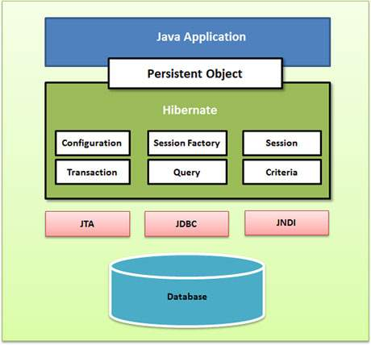

# Hibernate
Hibernate is a Java framework that simplifies the development of Java applications to interact with the database.
It is an open-source, lightweight, ORM (Object Relational Mapping) tool. Hibernate implements the specifications of JPA (Java Persistence API) for data persistence.
An ORM tool simplifies data creation, data manipulation and data access.

## Advantages Hibernate
1. Open Source
2. Lightweight
3. High Performance
4. Independent Query Language
5. Automatic Table Creation
6. Simplifies Complex Joins
7. Status and Statics Matrix

## Hibernate Architecture Diagram

## Hibernate Components
**1. Configuration** - The Configuration object is the first Hibernate object you create in any Hibernate application. It is usually created only once during application initialization. It represents a configuration or properties file required by the Hibernate. It provides two keys components −

* Database Connection – This is handled through one or more configuration files supported by Hibernate. These files are hibernate.properties and hibernate.cfg.xml.
* Class Mapping Setup – This component creates the connection between the Java classes and database tables.

**2. SessionFactory** - The SessionFactory is a factory of session and client of ConnectionProvider. It holds second level cache (optional) of data. This provides factory method to get the object of Session. It is a heavyweight object and usually created during application start up and kept for later use. You would need one SessionFactory object per database using a separate configuration file.

**3. Session** - The session object provides an interface between the application and data stored in the database. It is a short-lived object and wraps the JDBC connection.
It holds a first-level cache (mandatory) of data. This interface provides methods to insert, update and delete the object. It also provides factory methods for Transaction, Query and Criteria. It is designed to be instantiated each time an interaction is needed with the database. Persistent objects are saved and retrieved through a Session object.The session objects should not be kept open for a long time because they are not usually thread safe and they should be created and destroyed them as needed.

**4. Transaction** - The transaction object specifies the atomic unit of work. This interface provides methods for transaction management.

**5. Query** - Query objects use SQL or Hibernate Query Language (HQL) string to retrieve data from the database and create objects. A Query instance is used to bind query parameters, limit the number of results returned by the query, and finally to execute the query.

**6. Criteria** - Criteria objects are used to create and execute object oriented criteria queries to retrieve objects.

## Hibernate LifeCycle
**1. Transient State** -This is the initial state of an object. Once we create an instance of POJO class, then the object entered in the transient state and object is not associated with the Session. So, the transient state is not related to any database. The transient objects exist in the heap memory. They are independent of Hibernate.

**2. Persistent State** - As soon as the object associated with the Session, it entered in the persistent state. Hence, we can say that an object is in the persistence state when we save or persist it. Here, each object represents the row of the database table.

**3. Detached State** - Once we either close the session or clear its cache, then the object entered into the detached state. As an object is no more associated with the Session, modifications in the data don't affect any changes in the database. However, the detached object still has a representation in the database. If we want to persist the changes made to a detached object, it is required to reattach the application to a valid Hibernate session. To associate the detached object with the new hibernate session, use any of these methods - load(), merge(), refresh(), update() or save() on a new session with the reference of the detached object.

## Inheritance Mappings
**1. Table Per Hierarchy** - Single table is required to map the whole hierarchy, an extra column (known as discriminator column) is added to identify the class.

**2. Table Per Concrete Class** - Tables are created as per class. But duplicate column is added in subclass tables.

**3. Table Per Sub Class** - Tables are created as per class but related by foreign key. So there are no duplicate columns.

## Code Samples
1. Using XML
2. Using Annotation
3. Table Per Hierarchy Mapping
4. Table Per Concrete Class Mapping
5. Table Per Sub Class Mapping
6. Hibernate Query Languages
7. Caching
8. List Mapping
9. Set Mapping
10. Map Mapping
11. Component Mapping
12. One to One Mapping
13. One to Many Mapping
14. Many to One Mapping
15. Many to Many Mapping